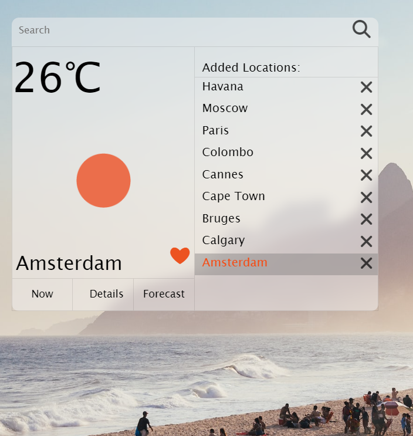
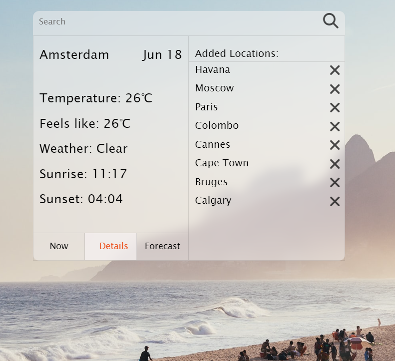
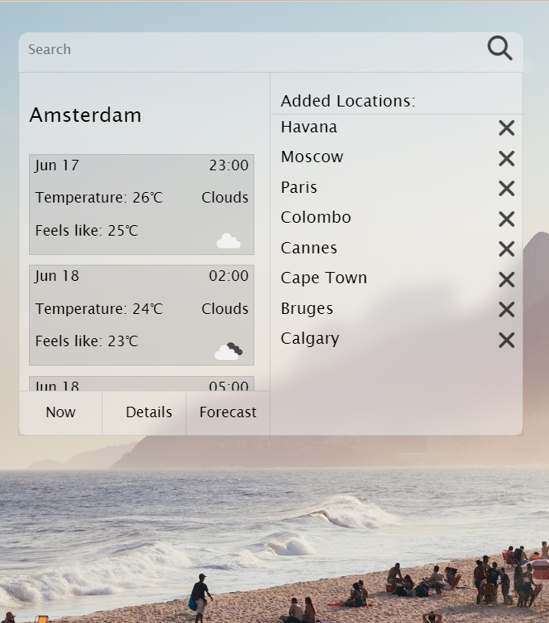

# Weather App

This Weather App is a simple application that provides weather information for different cities. It offers a user-friendly interface with three tabs to navigate through the app's features.

## Features

1. **Current Weather**: The first tab displays the current weather by default for a selected city. It shows the city name, an icon representing the current weather conditions, and the temperature in degrees.

2. **Weather Details**: The second tab provides more detailed information about the weather in the selected city for the current day. It includes temperature, feels like temperature, weather description, sunrise and sunset times.

3. **Forecast**: The third tab presents a scrollable forecast for the next day, showing the weather conditions at three-hour intervals. It includes temperature, precipitation, and weather icons for each interval.

4. **Favorite Cities**: The app allows you to add an unlimited number of favorite cities. The list of favorite cities is scrollable, making it easy to manage and access weather information for multiple locations. The user is able to add the city by toggling a heart in the weather card of a selected city. By the same toggling the heart back the city os deleted from the favourites. The cities are easily deleted by the clicking on the corresponding x-mark.

## Installation

To use the Weather App, follow these steps:

1. Clone the repository or download the source code.

2. Make sure you have Node.js installed on your machine.

3. Open a terminal or command prompt and navigate to the project directory.

4. Install the dependencies by running the following command:

npm install

This command will install the required dependencies, including the `date-fns` library and Parcel bundler.

5. Once the installation is complete, you can start the app by running the following command:

npx parcel index.html

This command will bundle the app and start a local development server.

6. Open your web browser and access the app by visiting `http://localhost:1234`.

That's it! You can now explore the Weather App and enjoy its features.

## Dependencies

The Weather App uses the following dependencies:

- `date-fns`: A JavaScript date utility library for parsing, manipulating, and formatting dates. Version 2.30.0 or higher is required.

## Development Dependencies

The following development dependency is used for building and bundling the app:

- `parcel`: A fast, zero-configuration web application bundler. Version 2.9.1 or higher is required.

Feel free to customize and enhance the Weather App according to your needs. Happy weather tracking!
